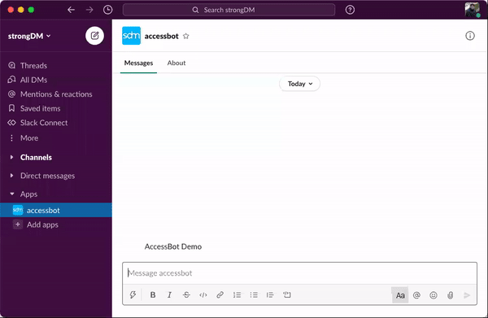

# Configure AccessBot

There are a number of variables you can use for configuring AccessBot.

## Required configuration
* **SLACK_TOKEN**. Slack Bot User OAuth Token
* **SDM_ADMINS**. List of Slack admins, format: `@usernick`. Although it's not required, these users are often SDM admins too. You could use `whoami` for getting user nicks. 
* **SDM_API_ACCESS_KEY**. SDM API Access Key
* **SDM_API_SECRET_KEY**. SDM API Access Key Secret

## Internal configuration
* **LOG_LEVEL**. Logging level. Default = INFO
* **SDM_DOCKERIZED**. Logging type. Default = true (_when using docker_), meaning logs go to STDOUT
* **SDM_COMMANDS_ENABLED**. AccessBot commands to be enabled. Default = access_resources assign_role show_resources show_roles

## Bot configuration
The following variables can be changed at runtime via slack -by an SDM_ADMIN- using the `plugin config AccessBot` command:
* **SDM_ADMIN_TIMEOUT**. Timeout in seconds for a request to be manually approved. Default = 30 sec
* **SDM_SENDER_NICK_OVERRIDE**. Nickname to be used for all requests. Default = None (_useful for testing_)
* **SDM_SENDER_EMAIL_OVERRIDE**. Email to be used for all requests. Default = None (_useful for testing_)
* **SDM_AUTO_APPROVE_ALL**. Flag to enable auto-approve for all resources. Default = false
* **SDM_AUTO_APPROVE_TAG**. Tag to be used for auto-approve resources. The tag value is not ignored, delete tag or set it false to disable. Default = None
* **SDM_AUTO_APPROVE_ROLE_ALL**. Flag to enable auto-approve for all roles. Default = false
* **SDM_AUTO_APPROVE_ROLE_TAG**. Tag to be used for auto-approve roles. The tag value is not ignored, delete tag or set it false to disable. Default = None
* **SDM_HIDE_RESOURCE_TAG**. Tag to be used for hidden resources. Ideally set value to `true` or `false` (e.g. `hide-resource=true`). If there's no value, it's interpreted as `true`. Default = None ([see below](#using-tags) for more info about using tags)
* **SDM_GRANT_TIMEOUT**. Timeout in minutes for an access grant. Default = 60 min
* **SDM_CONTROL_RESOURCES_ROLE_NAME**. Role name to be used for getting available resources. Default = None
* **SDM_ADMINS_CHANNEL**. Channel name to be used by administrators for approval messages, for example: `#accessbot-private` (important to start with `#`). Default = None
* **SDM_MAX_AUTO_APPROVE_USES** and **SDM_MAX_AUTO_APPROVE_INTERVAL**. Max number of times that the auto-approve functionality can be used in an interval of configured minutes. Defaults = None / None
* **SDM_USER_ROLES_TAG**. Tag to be used for controlling the roles a user can request. Default = None

See image below for more information:



### Some tricks
* Use `plugin config AccessBot {}` for setting config to initial state. This command needs to be executed in a direct chat with AccessBot, cannot be used in channels
* Use `plugin info AccessBot` for showing all configurations, including remaining auto-approve uses
* Use `whoami` for showing user configuration. Use the `nick` field for the `SDM_ADMINS` variable

### Known issues
* When using `plugin config` from a Mac, you will need to disable: 
`System Preferences > Keyboard > Text > Uncheck "Use smart quotes and dashes`. The `config` command fails to understand quotes as unicode characters.

### Using Tags
A snippet that might help:
```
$ sdm admin ssh list
Server ID               Name
rs-xxxxxxxxxxxxxxx     public-key-ssh
$ sdm admin ssh update --id rs-xxxxxxxxxxxxxxx --tags 'hide-resource='
changed 1 out of 1 matching datasource
$ sdm admin ssh list -e
Server ID               Name               Hostname                Port     Username           Port Override     Port Forwarding     Healthy     Secret Store ID     Egress Filter     Tags
rs-xxxxxxxxxxxxxxx     public-key-ssh     my-gw.example.com     2222     linuxserver.io     14760             false               true                                              hide-resource=
$ sdm admin ssh update --id rs-xxxxxxxxxxxxxxx --delete-tags 'hide-resource'
changed 1 out of 1 matching datasource
```

Basically, you need to get the resource id and then add a tag with the name you've configured in `SDM_HIDE_RESOURCE_TAG`. In the example above, we're assuming that `SDM_HIDE_RESOURCE_TAG=hide-resource`. In order to "unhide" the resource, just delete the tag.
 
From [AccessBot v1.0.3](https://github.com/strongdm/accessbot/releases/tag/1.0.3) the value of the tag is interpreted (see [here](https://github.com/strongdm/accessbot/issues/83)). You could use: `hide-resource=false` instead of deleting the tag. For more information about using tags please refer to the [documentation](https://www.strongdm.com/docs/automation/getting-started/tags).

#### User Roles
```
$ sdm admin users list
User ID                First Name     Last Name     Email                            Tags
a-xxx                  Firstname1     Lastname1     user1@example.com
a-yyy                  Firstname2     Lastname2     user2@example.com
$ sdm admin users update --email user1@example.com --tags 'sdm-roles="dev,prod"'
$ sdm admin users list
User ID                First Name     Last Name     Email                              Tags
a-xxx                  Firstname1     Lastname1     user1@example.com          sdm-roles="dev,prod"
a-yyy                  Firstname2     Lastname2     user2@example.com
$ sdm admin users update --email user1@example.com --delete-tags 'sdm-roles'
```

IMPORTANT:
* Remember to separate values with commas
* Remember to enclose multiple values between double quotes (`"`)

From [AccessBot v1.0.3](https://github.com/strongdm/accessbot/releases/tag/1.0.3) the value of the tag is interpreted (see [here](https://github.com/strongdm/accessbot/issues/83)). You could use: `hide-resource=false` instead of deleting the tag. For more information about using tags please refer to the [documentation](https://www.strongdm.com/docs/automation/getting-started/tags).
