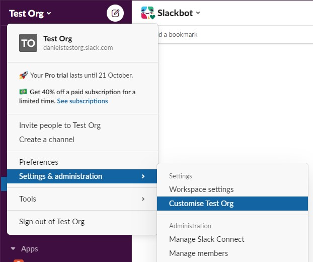
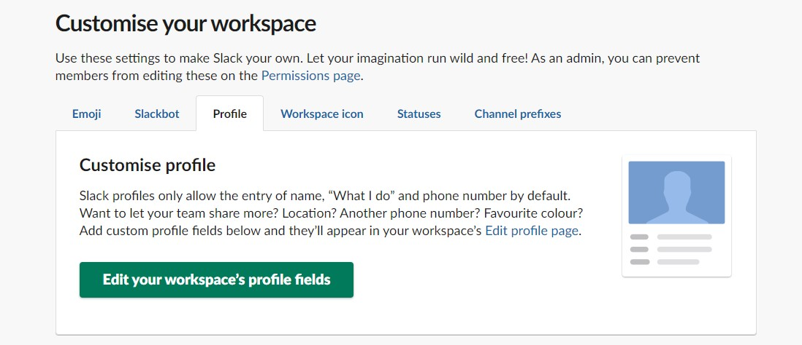
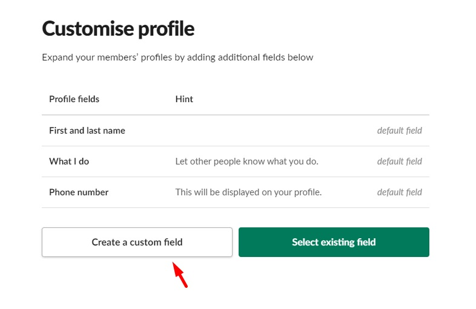
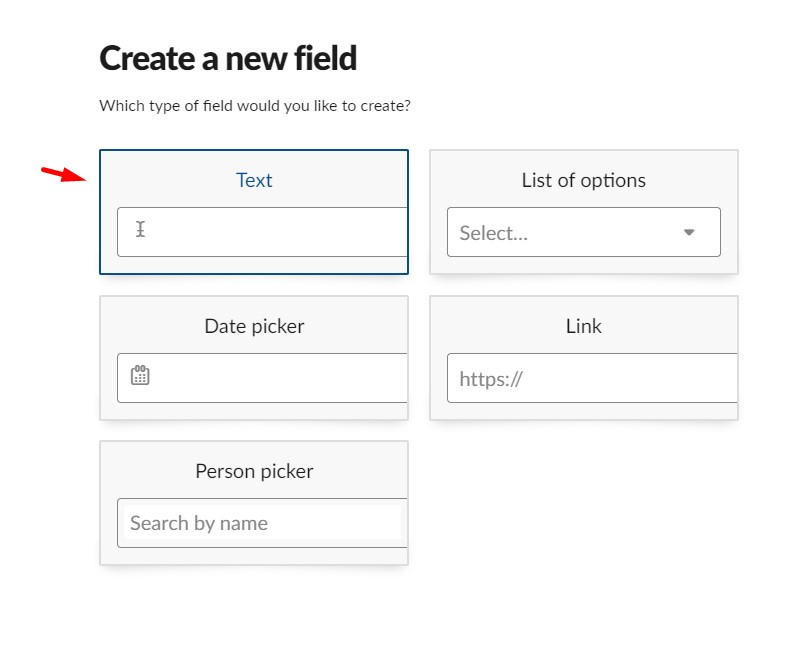
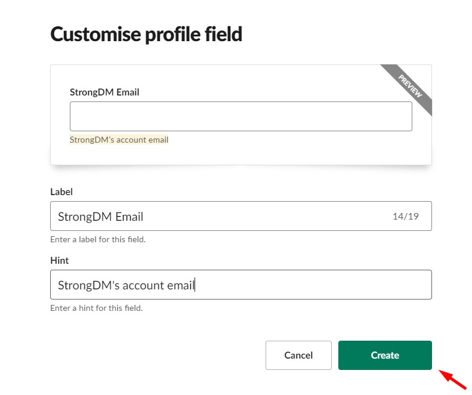
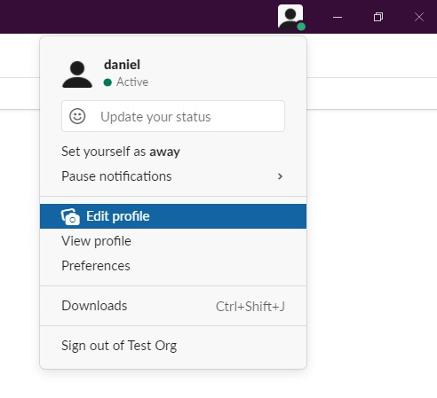
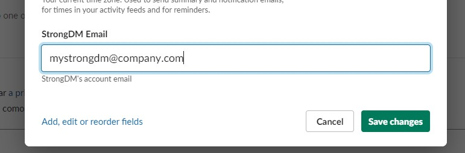

# Alternative E-mail

To use alternative e-mails between Slack and StrongDM, follow the steps below:

1. Go to your slack organization, click in the top left dropdown menu with the name of organization and select `Settings & Administration > Customize my-workspace-name`:

2. After the page loads, select `Profile` tab and click in `Edit your workspace's profile fields`:

3. Click in `Create a custom field`:

4. Click in the `Text` box:

5. Enter the `label` and the `hint` (feel free to use any values you want, but we suggest to use as follows):

6. After that, go back to slack window and go to `Edit profile`:

7. And fill the field that you added in the step 5 with your StrongDM account email:

